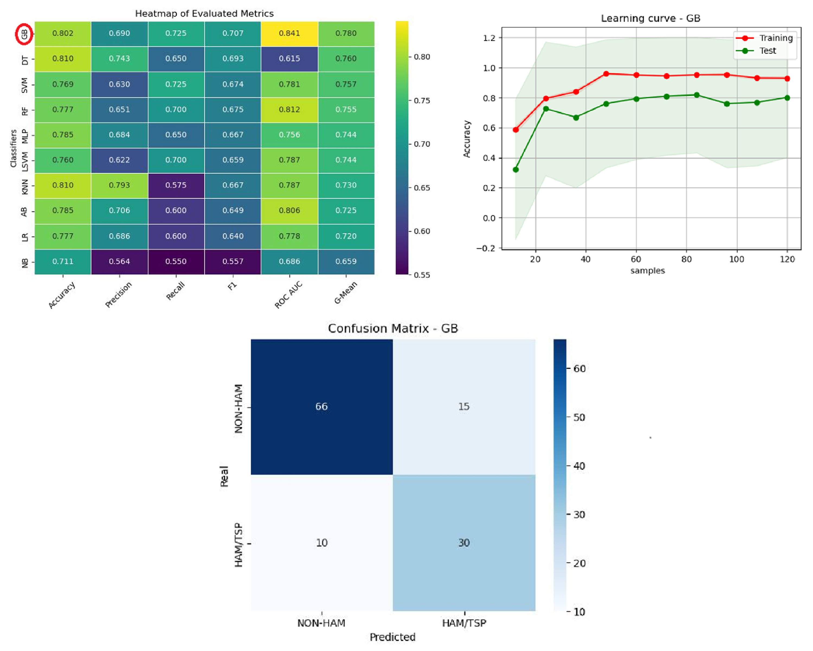

Description:
The ProgHAM repository contains the implementation of a trained Gradient Boosting machine learning model designed to predict people living with HTLV (PLwHTLV) with a indicative of development HAM/TSP (HTLV-1-associated myelopathy/tropical spastic paraparesis).The model was developed using a clinical dataset of 121 PLwHTLV, employing undersampling via Tomek Links to address data imbalance.

The goal of ProgHAM is to provide a predictive model that supports medical follow-up for patients, enabling better risk stratification for the progression of HAM/TSP.

This tool is available to free use at the link:
https://colab.research.google.com/drive/1l2LJ3UHxk_TUmd6OI3ihus8CetPF0xFP

📂 Model Development
The ProgHAM_model_development folder contains all the steps for model development, including:
📌 Data preprocessing and feature selection
📌 Model training and hyperparameter tuning
📌 Performance evaluation and validation

🔬 Key Features
✅ Data Preprocessing: Cleaning, normalization, and balancing using Tomek Links.
✅ Model Training: Implementation of Gradient Boosting for clinical prognosis prediction.
✅ Reproducibility: Modular code and notebooks to facilitate pipeline execution.

🖼 Project Overview
To better illustrate ProgHAM's performance, the following image provides an overview of its performance (It is worth emphasising that the tool requires validation for clinical use and should be used as a support tool for clinical staff, NOT AS A DIAGNOSIS DEVICE):

  

